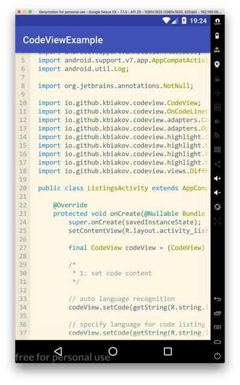
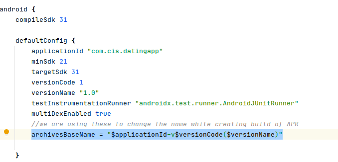

# important-links

1. **For Attandance system** https://github.com/eisaadil/AttendanceCam
2. **For Finger Print** https://github.com/anitaa1990/Biometric-Auth-Sample
3. **For Video calling** https://github.com/AgoraIO/Basic-Video-Call
4. **Video trimmer** https://github.com/a914-gowtham/Android-video-trimmer
5. **Paste board** https://pasteboard.co/
6. **Image Video Editor** https://github.com/maulik22995/ImageVideoEditor
7. **Image editor** https://github.com/burhanrashid52/PhotoEditor
8. **Image editor** https://github.com/iam-mhaseeb/Photo-Editor-App
9. **To get the paid code** https://codecanyon.net
10. **Photo editing and other lib in common** https://appscms.com/library/sticker-library-android
11. **Shape images** https://howtodoandroid.com/shapeableimageview-material-components-android/
12. **Get different shapes** https://creazilla.com/
13. **IMAGE SHAPE CHANGE LINK** https://www.tuxpi.com/photo-effects/shape-tool
14. **ADOBE SPARK** https://spark.adobe.com/sp
15. **FOR VECTOR** https://creazilla.com/sections/1-vectors
16. **FOR UNDRAW** https://undraw.co/
17. **CUSTOME LIB** https://android-arsenal.com/
18. **EXPAMLE CODE** http://www.java2s.com/ 
19. **FOR CODE SPINNET** https://rosemoe.github.io/2021/08/22/editor-get-started/  https://github.com/kbiakov/CodeView-Android 
https://github.com/Rosemoe/CodeEditor

20. **TO GET SHA1**   keytool -exportcert -alias androiddebugkey -keystore ~/.android/debug.keystore | openssl sha1 -binary | openssl base64  keytool -list -v -keystore ~/.android/debug.keystore -alias androiddebugkey -storepass android -keypass android

21. **GOOGLE PLACE API**  In future if u need to get the places without Google Place SDK, 
Refer these document :  https://developers.google.com/maps/documentation/places/web-service/autocomplete#maps_http_places_autocomplete_pt_br-java  For exapmle : https://maps.googleapis.com/maps/api/place/autocomplete/json?input=Frei&types=(regions)&key=12345AIzaSyDXCokn_12345W0qPmpMN8UrRadhkHg4pTVgHsw12345  **GET METHOD**  input:Frei  types:(regions)  key: 12345AIzaSyDXCokn_12345W0qPmpMN8UrRadhkHg4pTVgHsw123456

22. **Change APK name**  Use these to change the name of apk while creating build  *Normally* : Go to App level gradle [build.grade(:app)] -->  defaultConfig archivesBaseName = "$applicationId-v$versionCode($versionName)" these will return "packagename-v1(1.0).apk"  *Other way* : If you don't want to show package name simply use archivesBaseName = "AnyCustomizeName-v$versionCode($versionName)" these will return "name-v1(1.0).apk"  

23. **Spark Animation**  For spark animation  
Android github.com/varunest/SparkButton  
iOS github.com/janselv/fave-button   
github.com/alexsteinerde/Spark-ImageView  
24.
25. 
